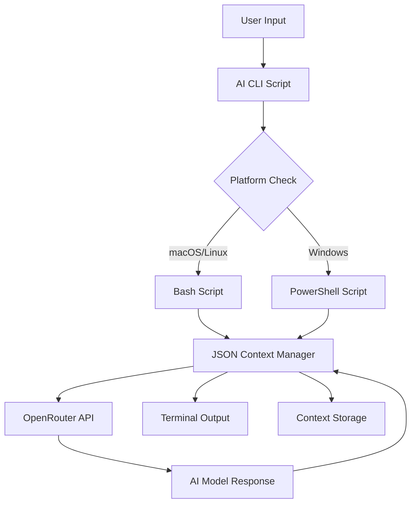
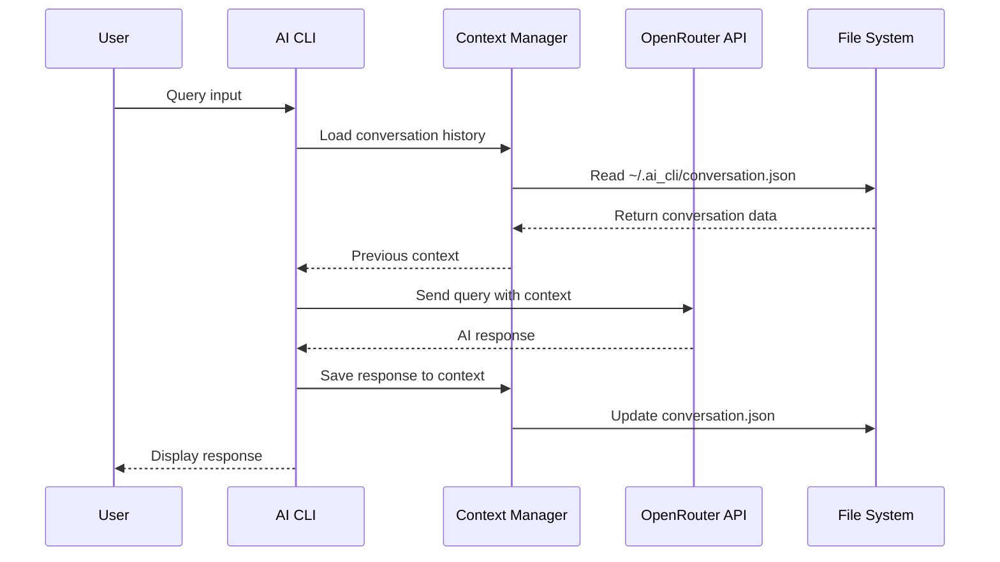

# 4_🌌_Imaginary - Visual Documentation and Concept Captures

## Purpose
This folder contains screenshots, visual documentation, diagrams, and concept captures that help learners understand the project through visual means. Following the Lacan triad methodology, this represents the "Imaginary" - the visual and conceptual understanding of the system.

## 📸 Visual Documentation Categories

### 1. User Interface Screenshots
Capture the visual experience of using the AI CLI tool across different platforms and scenarios.

### 2. Architecture Diagrams
Visual representations of system architecture, data flow, and component relationships.

### 3. Learning Concepts
Visual aids for understanding complex concepts like API integration, context management, and cross-platform development.

### 4. Error Examples
Screenshots of error messages and their resolution steps for troubleshooting guides.

### 5. Setup Demonstrations
Visual step-by-step setup processes for different environments.

## 📁 Folder Structure

```
4_🌌_Imaginary/
├── README.md
├── screenshots/
│   ├── cli-usage/
│   ├── setup-process/
│   ├── error-examples/
│   └── platform-comparisons/
├── diagrams/
│   ├── architecture/
│   ├── data-flow/
│   └── concept-maps/
├── concepts/
│   ├── api-integration/
│   ├── context-management/
│   └── cross-platform/
└── templates/
    ├── screenshot-template.md
    └── diagram-guidelines.md
```

## 🎯 Visual Learning Objectives

### For Beginners
- **Visual Understanding**: See what the tool looks like in action
- **Setup Clarity**: Visual confirmation of correct setup steps
- **Error Recognition**: Identify and understand common error messages
- **Platform Differences**: Visually compare different platform implementations

### For Intermediate Learners
- **Architecture Comprehension**: Understand system design through diagrams
- **Data Flow Visualization**: See how data moves through the system
- **Integration Patterns**: Visual representation of API integration
- **Context Management**: Understand conversation flow and persistence

### For Advanced Learners
- **System Design**: Complete architectural overview
- **Optimization Opportunities**: Visual identification of improvement areas
- **Troubleshooting Patterns**: Pattern recognition for common issues
- **Extension Possibilities**: Visual brainstorming for new features

## 📷 Screenshot Guidelines

### Essential Screenshots to Capture

#### 1. Basic Usage Examples
**Files**: `cli-usage/basic-query.png`, `cli-usage/help-output.png`
```bash
# Commands to screenshot:
./6_🔣_Symbols/ai.sh "What is artificial intelligence?"
./6_🔣_Symbols/ai.sh --help
```

#### 2. Context Management
**Files**: `cli-usage/context-flow.png`, `cli-usage/conversation-history.png`
```bash
# Commands to screenshot:
./6_🔣_Symbols/ai.sh --new "Hello, I'm learning about AI"
./6_🔣_Symbols/ai.sh "Tell me more about machine learning"
./6_🔣_Symbols/ai.sh --context
```

#### 3. Platform Comparisons
**Files**: `platform-comparisons/macos-terminal.png`, `platform-comparisons/windows-powershell.png`
- Side-by-side comparison of same command on different platforms
- Highlighting visual differences in output formatting

#### 4. Setup Process
**Files**: `setup-process/dependency-install.png`, `setup-process/api-key-setup.png`
- Installation of jq and other dependencies
- Environment variable configuration
- First successful run

#### 5. Error Examples
**Files**: `error-examples/missing-api-key.png`, `error-examples/network-error.png`
- Common error scenarios with clear error messages
- Before and after resolution screenshots

### Screenshot Naming Convention
```
[category]/[platform]-[feature]-[timestamp].png

Examples:
- cli-usage/macos-basic-query-20241201.png
- error-examples/windows-missing-jq-20241201.png
- setup-process/linux-environment-setup-20241201.png
```

### Screenshot Quality Standards
- **Resolution**: Minimum 1920x1080 for desktop screenshots
- **Format**: PNG for clarity, JPG for file size optimization
- **Annotations**: Use red boxes/arrows to highlight important elements
- **Context**: Include enough surrounding context to understand the situation
- **Consistency**: Use the same terminal/font settings across screenshots

## 🎨 Diagram Creation Guidelines

### Architecture Diagrams

#### System Architecture
**File**: `diagrams/architecture/system-overview.svg`


#### Data Flow Diagram
**File**: `diagrams/data-flow/conversation-flow.svg`


### Concept Maps

#### API Integration Concepts
**File**: `concepts/api-integration/openrouter-integration.png`
- Visual representation of API key authentication
- Request/response cycle visualization
- Error handling flow

#### Context Management Concepts
**File**: `concepts/context-management/conversation-persistence.png`
- JSON structure visualization
- Context lifecycle diagram
- Memory management illustration

### Diagram Tools Recommendations
1. **Mermaid** - For flowcharts and sequence diagrams
2. **Draw.io/Lucidchart** - For complex system diagrams
3. **Excalidraw** - For hand-drawn style diagrams
4. **PlantUML** - For UML diagrams
5. **ASCII Art** - For simple inline diagrams

## 🖼️ Visual Learning Templates

### Screenshot Template
**File**: `templates/screenshot-template.md`
```markdown
# Screenshot: [Title]

## Context
- **Command Used**: `command here`
- **Platform**: macOS/Linux/Windows
- **Purpose**: What this demonstrates
- **Date Captured**: YYYY-MM-DD

## Description
Brief description of what's shown in the screenshot.

## Key Elements
- 🔴 **Red Box**: Important element to notice
- 🟡 **Yellow Arrow**: Flow direction or relationship
- 🔵 **Blue Circle**: Optional or secondary element

## Learning Points
1. What learners should observe
2. What this teaches about the system
3. Common variations or alternatives

## Related Files
- Link to related code files
- Link to related documentation
- Link to troubleshooting guides


```

### Concept Visualization Template
```markdown
# Concept: [Topic Name]

## Visual Representation


## Key Components
1. **Component A**: Description and role
2. **Component B**: Description and role
3. **Component C**: Description and role

## Relationships
- How components interact
- Data flow between components
- Dependencies and requirements

## Real-World Analogy
Compare to familiar concept (e.g., "like a conversation with memory")

## Implementation Details
- How this concept is implemented in code
- Files where this concept is realized
- Configuration options available
```

## 📊 Visual Progress Tracking

### Screenshot Collection Checklist
- [ ] **Basic Usage** (5 screenshots)
  - [ ] First run and help output
  - [ ] Simple query and response
  - [ ] Context commands demonstration
  - [ ] Different model usage
  - [ ] Second brain save feature

- [ ] **Platform Comparisons** (6 screenshots)
  - [ ] macOS terminal output
  - [ ] Linux terminal output
  - [ ] Windows PowerShell output
  - [ ] Side-by-side comparisons
  - [ ] Platform-specific features
  - [ ] Setup process variations

- [ ] **Error Scenarios** (8 screenshots)
  - [ ] Missing API key error
  - [ ] Network connection error
  - [ ] Invalid model error
  - [ ] Missing dependencies
  - [ ] Permission errors
  - [ ] JSON parsing errors
  - [ ] API rate limiting
  - [ ] Context file corruption

- [ ] **Setup Process** (10 screenshots)
  - [ ] Dependency installation (macOS)
  - [ ] Dependency installation (Linux)
  - [ ] PowerShell setup (Windows)
  - [ ] Environment variable setup
  - [ ] First successful run
  - [ ] Directory structure
  - [ ] File permissions setup
  - [ ] API key configuration
  - [ ] Test command execution
  - [ ] Validation success

### Diagram Creation Progress
- [ ] **System Architecture** (3 diagrams)
  - [ ] Overall system architecture
  - [ ] Component relationships
  - [ ] Deployment architecture

- [ ] **Data Flow** (4 diagrams)
  - [ ] Request/response flow
  - [ ] Context management flow
  - [ ] Error handling flow
  - [ ] Authentication flow

- [ ] **Concept Maps** (5 diagrams)
  - [ ] API integration concepts
  - [ ] Context persistence concepts
  - [ ] Cross-platform considerations
  - [ ] Security and authentication
  - [ ] Future extension possibilities

## 🎓 Using Visuals for Learning

### Study Techniques
1. **Visual Walkthrough**: Use screenshots to follow along with setup
2. **Compare and Contrast**: Use platform comparison images
3. **Error Recognition**: Study error screenshots to recognize issues
4. **Flow Understanding**: Use diagrams to understand system flow
5. **Concept Reinforcement**: Use concept maps to solidify understanding

### Teaching Applications
1. **Presentation Materials**: Use visuals in presentations or tutorials
2. **Documentation Enhancement**: Embed visuals in written guides
3. **Troubleshooting Aids**: Reference error screenshots for help
4. **Onboarding Materials**: Use setup screenshots for new users
5. **Architecture Reviews**: Use diagrams for technical discussions

## 📱 Mobile and Accessibility Considerations

### Mobile-Friendly Visuals
- Ensure screenshots are readable on small screens
- Use high contrast for better visibility
- Provide alternative text descriptions
- Consider dark mode variations

### Accessibility Features
- Alt text for all images
- High contrast versions available
- Text descriptions of visual elements
- Screen reader friendly formats

## 🔄 Visual Content Maintenance

### Update Schedule
- **Monthly**: Review screenshots for UI changes
- **Quarterly**: Update architecture diagrams
- **Annually**: Comprehensive visual audit
- **As Needed**: Update for new features or bug fixes

### Version Control for Visuals
- Use descriptive commit messages for visual updates
- Tag major visual documentation releases
- Maintain changelog for visual content
- Archive outdated visuals with date stamps

## 🔗 Integration with Other Folders

### Cross-References
- **Journey Folder**: Screenshots support setup guides
- **Formulas Folder**: Diagrams illustrate implementation patterns
- **Symbols Folder**: Code screenshots show actual implementations
- **Semblance Folder**: Error screenshots aid troubleshooting
- **Real Folder**: Progress screenshots track objective completion

### Visual Documentation Workflow
1. **Capture**: Take screenshots during development/testing
2. **Annotate**: Add callouts and explanations
3. **Organize**: File in appropriate category folders
4. **Reference**: Link from other documentation
5. **Maintain**: Update as system evolves

## 📖 Additional Resources

### Tools for Visual Documentation
- **Screenshot Tools**: macOS (Shift+Cmd+4), Windows (Win+Shift+S), Linux (gnome-screenshot)
- **Annotation Tools**: Skitch, Snagit, GIMP
- **Diagram Tools**: Draw.io, Mermaid, PlantUML
- **Image Optimization**: ImageOptim, TinyPNG
- **Accessibility Testing**: WAVE, aXe

### Visual Design Guidelines
- Consistent color scheme across all visuals
- Clear, readable fonts (minimum 12pt)
- High contrast ratios for accessibility
- Consistent annotation style (colors, shapes)
- Professional appearance for credibility